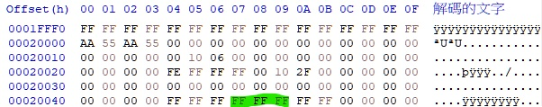
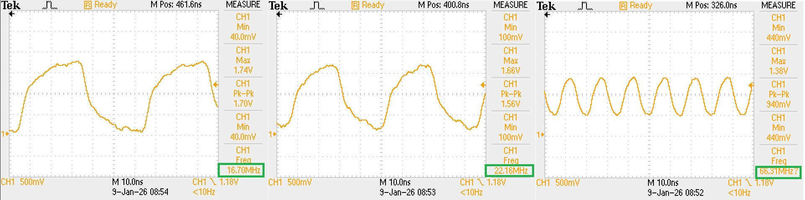

# How to set SPI speed and mode default

**Platform: AMD SIENA**

**1. Pre-knowledge should know**

**1.1 AGESA Boot Flow**

58203_1.00 Siena SP6 Platform Firmware Training
(Page 20)


**2. Modify the PSP EFS table**

**2.1 Chapter 3.4.16 (58289_1.20_NDA.pdf)**

PSP firmware 
will configure SPI ReadMode and FastSpeed if the data of EFS offset 0x47/0x48/0x49 are valid 
values.

Q: Valid values?<br>

符合datasheet定義的SpiReadMode/SpiFastSpeed值否則"do nothing"<br>


BIOS 的設定 token如下，default全為0xFF為do nothing的設定。

- SPI_MODE=0xFFFFFFFF
- SPI_SPEED=0xFFFFFFFF

<br>

**2.2 Binary**

Refer Doc#57299 - AMD Platform Security 
Processor BIOS 
Implementation Guide for 
Server EPYC Processors<br>

- 0x55AA55AA是PSP用來識別EFS table的signature

- Family 19h Models 10h–1Fh onward: **Only one EFS is supported.** It is at offset **0x20000.**

- There are two PCD tokens related with SPI ReadMode and FastSpeedNew settings.<br> 
FCH code will not consume these tokens to configure SPI in PEI phase to avoid FCH override 
PSP firmware settings.<br>

    Refer Chapter 3.4.16 (58289_1.20_NDA.pdf) :<br>

    ```
    gEfiAmdAgesaModulePkgTokenSpaceGuid.PcdResetMode
    gEfiAmdAgesaModulePkgTokenSpaceGuid.PcdResetFastSpeed
    ```

    


<br>
<br>

**3. BIOS**


**3.1 The SPI configuration registers are accessed through SPI base address specified by FCH::LPCPCICFG::SPI_BASE_ADDR**.

Refer 57228 (PPR Vol 7 for AMD Family 19h Model A0h A2)


**3.2 Agesa**

AgesaModulePkg\AgesaModuleFchPkg.dec


- PEI設定SPI speed
 FCH::LPCHOSTSPIREG::SPI100ENABLE_REGISTER<br>
0x11310713<br>
<br>


把new SPI100 speed設為33.33<br>


#new SPI100 engine.<br>
#old SPI100 engine.<br>

Q: what's SPI100 engine? new vs old?<br>

**3.2 DxeSmmReadyToLockRaCallback，用 "PcdRomArmorEnable" 將SPI mmio configuration space鎖上**

```
--- SPI_Flash_Ready_To_Lock callback ---
--- Spi settings start(89) ---
00 20 C8 0F 00 00 00 00 00 00 00 00 00 03 00 02 
00 01 00 00 B2 E2 00 00 03 0B 0A 02 00 98 00 00 
13 07 31 11 08 20 20 20 0C 14 06 0E C0 54 00 80 
C0 14 08 46 03 00 00 00 FC FC FC FC FC 88 00 00 
3B 6B BB EB 00 05 00 00 01 00 00 02 03 03 01 00 
01 12 13 0C 3C 6C BC EC 08 46 00 00 03 00 00 00 
00 00 00 00 FD 00 00 00 00 00 00 00 04 32 00 00 
00 00 00 00 00 00 00 00 00 00 00 00 00 00 00 00 
00 00 00 F6 56 41 52 69 6D 75 6D 54 61 62 6C 65 
53 69 7A 65 00 04 43 72 61 74 63 68 42 75 66 66 
65 72 00 18 60 48 A5 00 00 00 00 00 00 00 00 00 
00 00 00 00 00 00 00 00 00 00 00 00 00 00 00 00 
00 00 01 00 00 00 00 00 00 00 00 00 00 00 00 00 
00 00 00 00 00 00 00 00 00 00 00 00 00 00 00 00 
00 00 00 00 00 00 00 00 00 00 00 00 00 00 00 00 
00 00 00 00 00 00 00 00 00 00 00 00 10 00 00 00 
--- Spi settings end ---
```

## 測試

**1. PcdRomArmorEnable[FALSE]**

修改AgesaModulePkg\AgesaModuleFchPkg.dec定義的PcdResetSpiSpeed，觀察暫存器變化。

**1.1 PcdResetSpiSpeed[0x00]**

SPI100ENABLE_REGISTER = 0x3131_0713

\\biosserver.advantech.corp\Upload\Lawrence.Guan\E781\SPI\log\putty_PcdResetSpiSpeed[00].log<br>

**1.2 PcdResetSpiSpeed[0x01]**

SPI100ENABLE_REGISTER = 0x0131_0713

System Hang at A915.

\\biosserver.advantech.corp\Upload\Lawrence.Guan\E781\SPI\log\putty_PcdResetSpiSpeed[01].log<br>

**1.3 PcdResetSpiSpeed[0x03]**

SPI100ENABLE_REGISTER = 0x2131_0713

\\biosserver.advantech.corp\Upload\Lawrence.Guan\E781\SPI\log\putty_PcdResetSpiSpeed[02].log<br>

**1.4 針對每個SPI SPEED，開出對應選項**

目標：釐清Normal speed/Alt speed/Tpm Speed的使用情境


**2. 手動調整**
進入 0xFEC10000 對 FCH::LPCHOSTSPIREG::SPI100ENABLE_REGISTER::tpmspeed[19:16] 調整SPI 速度<br>



**3. Datasheet 描述 Change SPI ROM Read mode/Speed:**
1. Rom read is handled by old Spi engine first which running 16.7M without prefetch enabled.
2. Program FCH::LPCHOSTSPIREG::SPI_CNTRL0_REGISTER to set up Read mode.
3. Program dummy cycle in FCH::LPCHOSTSPIREG::SPI100_DUMMY_CYCLE_CONFIG_REGISTER to match
the dummy cycle number of SPI Rom.
1. Program speed for all operations in FCH::LPCHOSTSPIREG::SPI100ENABLE_REGISTER.
2. Program UseSpi100 to 1 in FCH::LPCHOSTSPIREG::SPI100ENABLE_REGISTER.
3. Program PrefetchEnSPIFromHost in FCH::LPCPCICFG::HOSTCONTROL to enable read prefetch.
