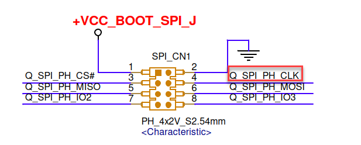

# How to set SPI READ speed default

**Platform: AMD SIENA**

**1. Pre-knowledge should know**

**1.1 AGESA Boot Flow**

58203_1.00 Siena SP6 Platform Firmware Training
(Page 20)


**2. Modify the PSP EFS table**

**2.1 Chapter 3.4.16 (58289_1.20_NDA.pdf)**

PSP firmware 
will configure SPI ReadMode and FastSpeed if the data of EFS offset 0x47/0x48/0x49 are valid 
values.

Q: Valid values?<br>

符合datasheet定義的SpiReadMode/SpiFastSpeed值否則"do nothing"<br>


BIOS 的設定 token如下，default全為0xFF為do nothing的設定。

- SPI_MODE=0xFFFFFFFF
- SPI_SPEED=0xFFFFFFFF

<br>

**2.2 Binary**

Refer Doc#57299 - AMD Platform Security 
Processor BIOS 
Implementation Guide for 
Server EPYC Processors<br>

- 0x55AA55AA是PSP用來識別EFS table的signature

- Family 19h Models 10h–1Fh onward: **Only one EFS is supported.** It is at offset **0x20000.**

- There are two PCD tokens related with SPI ReadMode and FastSpeedNew settings.<br> 
FCH code will not consume these tokens to configure SPI in PEI phase to avoid FCH override 
PSP firmware settings.<br>

    Refer Chapter 3.4.16 (58289_1.20_NDA.pdf) :<br>

    ```
    gEfiAmdAgesaModulePkgTokenSpaceGuid.PcdResetMode
    gEfiAmdAgesaModulePkgTokenSpaceGuid.PcdResetFastSpeed
    ```

    


<br>
<br>

**3. BIOS**


**3.1 Agesa**

AgesaModulePkg\AgesaModuleFchPkg.dec

- PEI設定 FCH::LPCHOSTSPIREG::SPI100ENABLE_REGISTER::normspeed[31:28]
- 單獨設定此暫存器無法固定SPI speed.

<br>

**3.2 DxeSmmReadyToLockRaCallback，AMI依據"PcdRomArmorEnable"，決定是否將SPI mmio configuration space鎖上。**

PcdRomArmorEnable[FALSE]，RU下可看見SPI mmio configuration space(FEC1_0000)的值

```
--- SPI_Flash_Ready_To_Lock callback ---
--- Spi settings start(89) ---
00 20 C8 0F 00 00 00 00 00 00 00 00 00 03 00 02 
00 01 00 00 B2 E2 00 00 03 0B 0A 02 00 98 00 00 
13 07 31 11 08 20 20 20 0C 14 06 0E C0 54 00 80 
C0 14 08 46 03 00 00 00 FC FC FC FC FC 88 00 00 
3B 6B BB EB 00 05 00 00 01 00 00 02 03 03 01 00 
01 12 13 0C 3C 6C BC EC 08 46 00 00 03 00 00 00 
00 00 00 00 FD 00 00 00 00 00 00 00 04 32 00 00 
00 00 00 00 00 00 00 00 00 00 00 00 00 00 00 00 
00 00 00 F6 56 41 52 69 6D 75 6D 54 61 62 6C 65 
53 69 7A 65 00 04 43 72 61 74 63 68 42 75 66 66 
65 72 00 18 60 48 A5 00 00 00 00 00 00 00 00 00 
00 00 00 00 00 00 00 00 00 00 00 00 00 00 00 00 
00 00 01 00 00 00 00 00 00 00 00 00 00 00 00 00 
00 00 00 00 00 00 00 00 00 00 00 00 00 00 00 00 
00 00 00 00 00 00 00 00 00 00 00 00 00 00 00 00 
00 00 00 00 00 00 00 00 00 00 00 00 10 00 00 00 
--- Spi settings end ---
```

<br>

## 示波器量到的值，對應SPI100ENABLE_REGISTER的哪一個Speed?

## 測試

**1 統一將 SPI100ENABLE_REGISTER**

normspeed<br>
fastspeednew<br>
altspeednew<br>
tpmspeed<br>
設為16.66MHZ<br>

FchInitResetSpi()<br>
```
  (*(volatile UINT8*)(UINTN)(SPI_BASE+0x22)) = 0x33;
  (*(volatile UINT8*)(UINTN)(SPI_BASE+0x23)) = 0x33;
```

量測結果:<br>
- ABL = 16.66MHZ : 目前觀察到ABL會固定在此速度，修改PSP設定無法生效。
- BIOS = 16.66MHZ : 此速度符合預期。
- AFU flash BIOS = 16.66MHZ : 此速度符合預期。

<br>

**2. 手動調整**
進入 0xFEC10000 對 FCH::LPCHOSTSPIREG::SPI100ENABLE_REGISTER::tpmspeed[19:16] 調整SPI 速度<br>



