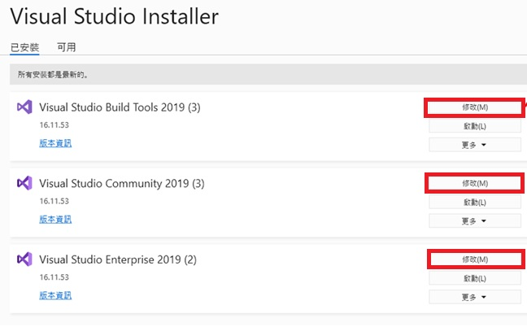
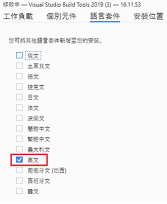
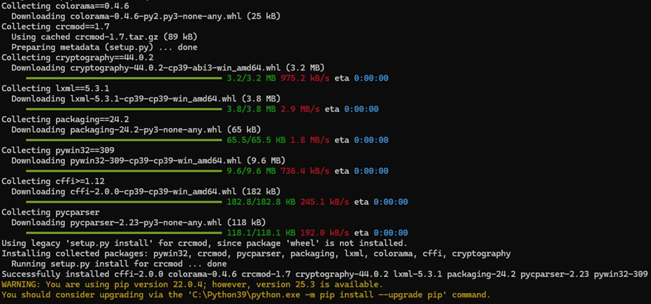
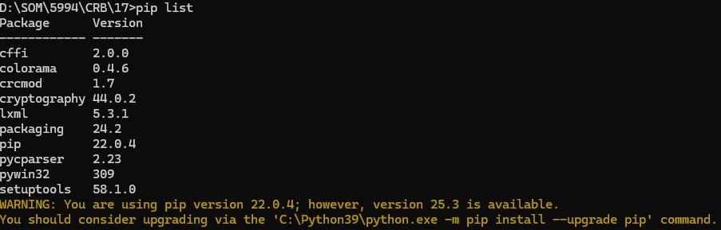

# Loganvillie build environment setting
## Error log 1：

Intel\ServerPlatformPkg\SetupDefaultValueScript.py", line 235, in main 
**stdout = stdout.decode("utf-8").replace("\r\n", "\n")** 
UnicodeDecodeError: 'utf-8' codec can't decode byte 0xb5 in position 105: invalid start byte

## ## 解決方式：

Visual studio 2019 with language package

若編譯器使用繁體中文，卻要解碼utf-8就會遇到此問題

Visual Studio Install > 修改 > language pack [English]

## Error log 2：

ModuleNotFoundError: No module named 'lxml'

## 解決方式：

切到根目錄 > 找到 requirements.win.txt

安裝 requirements.win.txt 內列出的 python library (非標準 python library)

Pip install –r requirements.win.txt

檢查

