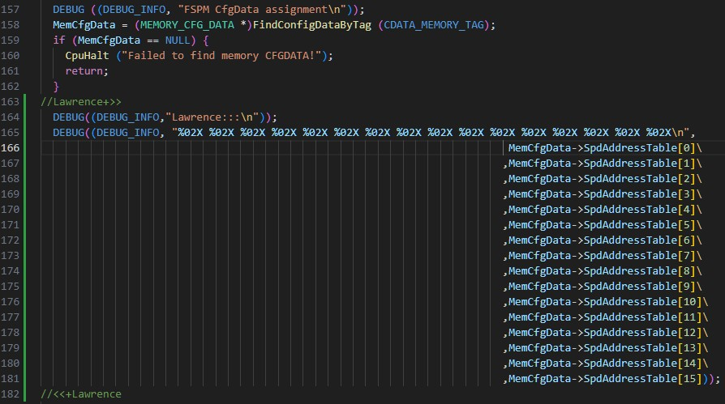
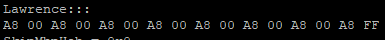
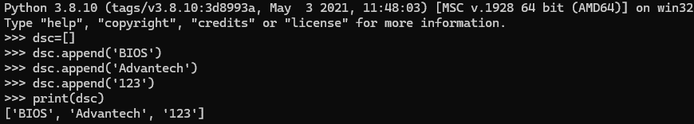
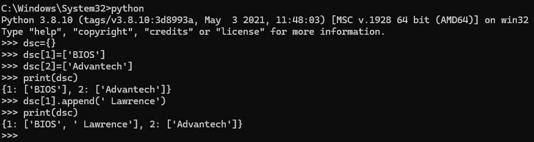
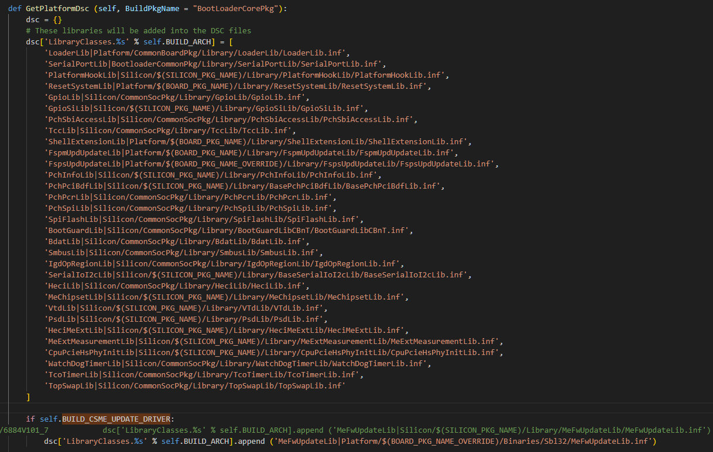

# Slim Bootloader 如何從 C code 找到 Platform Specific Configure Data？
## 以 SPD Data 為例，會透過 CDATA_MEMORY_TAG 取得記憶體設定資料：
### 取得 Memory Configuration Data
MEMORY_CFG_DATA *MemCfgData = (MEMORY_CFG_DATA *)FindConfigDataByTag(CDATA_MEMORY_TAG);

## Memory Configure Data 會依什麼條件取得？

## 條件：
Platform ID + CDATA_MEMORY_TAG

## 對應的設定檔路徑範例：

Platform\RaptorlakeBoardPkg\CfgData\CfgDataInt_Rplp_Rvp_Ddr5_SOM_6884A2.dlt

## Test Result

# 如何 Implement board specific initialization during the boot flow？
## 1. 在 Stage 2，會帶入各phase，做specific initial  e.g: BoardInit (PrePciEnumeration)
##   所以在 BoardInit 插入 Stage2BoardInitNotify 在各 phase 完成 specific initial。

### 1.1 透過 EC PMC command 設 ACPI off/on
###   為什麼可以 使用EC PMC command?
###   在  Platform\AlderlakeBoardPkg\Library\Stage2BoardInitLib\Stage2BoardInitLib.inf 加入 A9610Lib.h/A9610Lib.c
### 1.2 Ready to boot 做 SYSTEM_OK。
###   在 Jump to payload 之前，call 進 ReadyToBoot，更新GPP_B17 狀態
###   V101沒點亮SYSTEM_OK，V102補上。
### 1.3 更新Smbios type 0。

## 2. 更新 CSME driver。
## Platform\RaptorlakeBoardPkg\BoardConfigRplp.py ， 會產生 Platform.dsc ，包含 Platform specific macro definitions 
## (e,g   DEFINE BUILD_CSME_UPDATE_DRIVER = 0x1)
## 2.1    self.BUILD_CSME_UPDATE_DRIVER   = 1
## 2.2    dsc = [] 在 Python 中的意思是：
## >  建立一個空的列表 (list)，並將它賦值給變數 dsc。
## >  列表是 Python 的一種資料結構，用來儲存 有序的元素集合，可以包含任何類型的資料（數字、字串、甚至其他列表）。
## >  [] 表示一個空列表，目前沒有任何元素。

