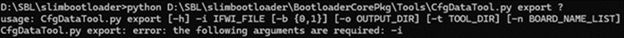
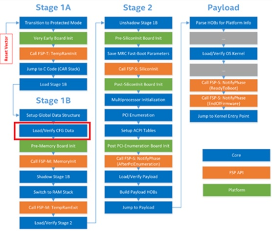
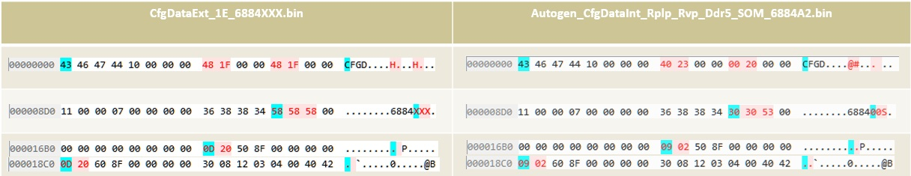

# 使用GUI介面改動選項

## 打開GUI編輯器

```
python D:\SBL\slimbootloader\BootloaderCorePkg\Tools\ConfigEditor.py
```


## Load YAML     
Platform\RaptorlakeBoardPkg\CfgData\CfgDataDefRplp.yaml

## Load Config Data from binary

Build\BootloaderCorePkg\DEBUG_VS2019\FV\ Autogen_CfgDataInt_Rplp_Rvp_Ddr5_SOM_6884A2.bin

載入後會看到 6884A2 的設定，測試修改Platform Name 從 “688400S” 到 “ˊ6884XXX”，另存Autogen_CfgDataInt_Rplp_Rvp_Ddr5_SOM_6884A2_MOD.bin

## 執行dlt檔合併


```
python D:\SBL\slimbootloader\BootloaderCorePkg\Tools\CfgDataTool.py merge D:\SBL\slimbootloader\Build\BootloaderCorePkg\DEBUG_VS2019\FV\CfgDataInt.bin D:\SBL\slimbootloader\Build\BootloaderCorePkg\DEBUG_VS2019\FV\Autogen_CfgDataInt_Rplp_Rvp_Ddr5.bin D:\SBL\slimbootloader\Build\BootloaderCorePkg\DEBUG_VS2019\FV\Autogen_CfgDataInt_Rplp_Rvp_Lpddr5.bin D:\SBL\slimbootloader\Build\BootloaderCorePkg\DEBUG_VS2019\FV\Autogen_CfgDataExt_Rplp_Upx12.bin D:\SBL\slimbootloader\Build\BootloaderCorePkg\DEBUG_VS2019\FV\Autogen_CfgDataInt_Rplp_Rvp_Ddr5_SOM_6884.bin D:\SBL\slimbootloader\Build\BootloaderCorePkg\DEBUG_VS2019\FV\Autogen_CfgDataInt_Rplp_Rvp_Ddr5_SOM_6884A2_MOD.bin D:\SBL\slimbootloader\Build\BootloaderCorePkg\DEBUG_VS2019\FV\Autogen_CfgDataExt_Rplp_Rki.bin -o test.bin
7 config binary files were merged successfully!
```

## Sign

```
python D:\SBL\slimbootloader\BootloaderCorePkg\Tools\CfgDataTool.py sign -o D:\SBL\slimbootloader\Build\BootloaderCorePkg\DEBUG_VS2019\FV\CFGDATA.bin -k KEY_ID_CFGDATA_RSA3072 -a SHA2_384 -s RSA_PSS -svn 0 D:\SBL\slimbootloader\test.bin
Key used for Singing D:\SBL\slimbootloader\Platform\RaptorlakeBoardPkg\Binaries\Keys\sblKeys\ConfigTestKey_Priv_RSA3072.pem !!
Config file was signed successfully!
```

Tips: <br>
How to check SBL build python command?
```
def CmdSign(Args):
    print ("Args %s\n" % Args)
```

## Replace

```
python BootloaderCorePkg\Tools\CfgDataTool.py replace -i Outputs\rplp\688400S0180V108.bin test.bin -o NEW.bin
IFWI/BIOS/RD1/CNFG
IFWI/BIOS/RD0/CNFG
Patching CFGDATA region at image offset 0x194F000 (len: 0x5000)!
Patching CFGDATA region at image offset 0x1CFA000 (len: 0x5000)!
2 CFGDATA region has been patched successfully !
```

## FAIL case 

### Export CfgData from IFWI binary

```
python D:\SBL\slimbootloader\BootloaderCorePkg\Tools\CfgDataTool.py export -i D:\SBL\slimbootloader\Outputs\rplp\688400S0180V108.bin
```



會產生 3個 CfgData binary from IFWI binary stage 1B :<br>
CfgDataInt.bin : Internal Config Data.<br>
CfgDataExt.bin : External Config Data.<br>
CfgDataExt_1E.bin : Board specific external config data.<br>




Offset 0000 相關 error message:
File "D:\SBL\slimbootloader\BootloaderCorePkg\Tools\CfgDataTool.py", line 361, in Parse
    DataCond = CCfgData.CDATA_COND.from_buffer(CondBin)
ValueError: Buffer size too small (0 instead of at least 4 bytes)

Offset 16B0/18C0相關error message:
 File "D:\SBL\slimbootloader\BootloaderCorePkg\Tools\CfgDataTool.py", line 382, in Parse
    raise Exception("Invalid CFGDATA binary blob format for file '%s' !" % CfgBinFile)
Exception: Invalid CFGDATA binary blob format for file 'D:\SBL\slimbootloader\CfgDataExt_1E_6884XXX_FAIL2.bin' 


