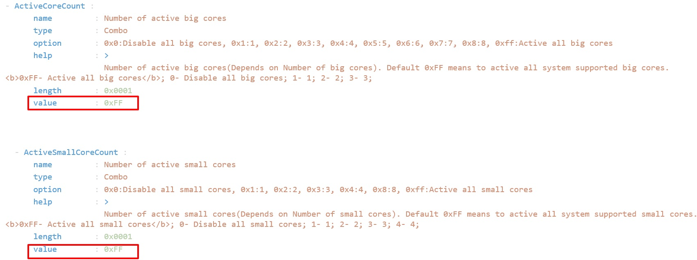
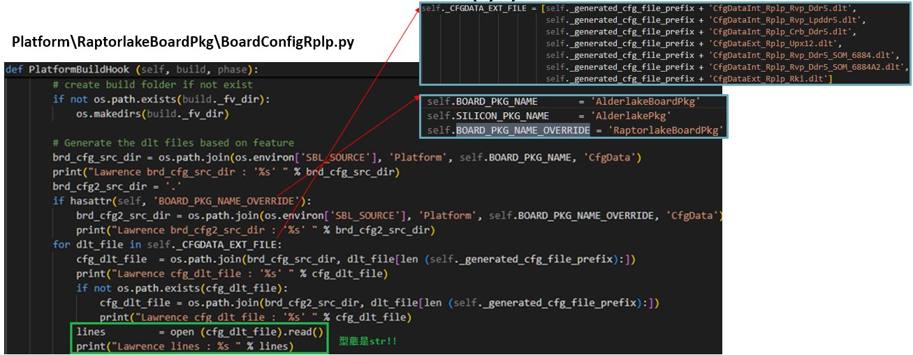
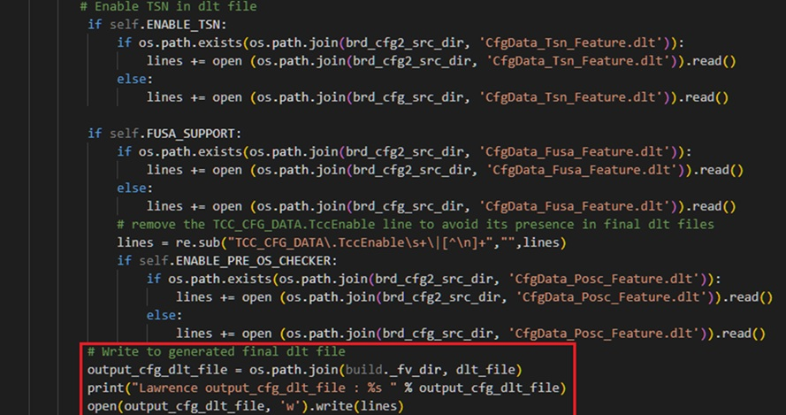
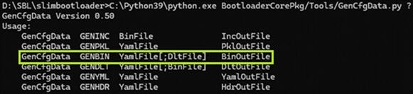
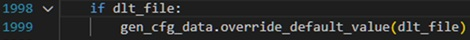
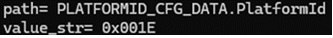
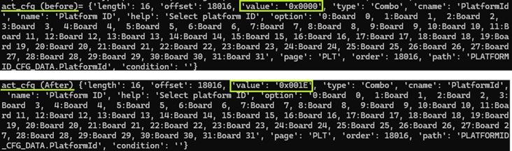

# DLT 和 YAML 的關係?

## 以 Active P-core 和 E-core 設定為例

> Platform\RaptorlakeBoardPkg\CfgData\CfgData_Memory.yaml




> Platform\RaptorlakeBoardPkg\CfgData\CfgDataInt_Rplp_Rvp_Ddr5_SOM_6884.dlt<br>

- #//Lawrence+>><br>
MEMORY_CFG_DATA.ActiveCoreCount                 | 0x1<br>
MEMORY_CFG_DATA.ActiveSmallCoreCount            | 0x1<br>
#//<<+Lawrence<br>

## 測試結果

ActiveCoreCount = 0x1<br>
ActiveSmallCoreCount = 0x1<br>

### BIOS Update flow

> Stage 1B > CallFspMemoryInit > UpdateFspConfig > Update FspmUpdPtr > Cold Reset

> UpdateFspConfig

```cpp
Fspmcfg->ActiveCoreCount      = MemCfgData->ActiveCoreCount;
Fspmcfg->ActiveSmallCoreCount = MemCfgData->ActiveSmallCoreCount;
```

> Update FspmUpdPtr
```
Status = FspmSwitchStack ((VOID *)(UINTN)FspMemoryInit, (VOID *)FspmUpdPtr, (VOID *)HobList, (VOID *)NewStack);
```

> Cold Reset
```cpp
if (Status == FSP_STATUS_RESET_REQUIRED_COLD){
            ResetSystem(EfiResetCold);
}
```

## Slim bootloader build behavior

build loader 時會 call 到 Platform\RaptorlakeBoardPkg\BoardConfigRplp.py

SBL 會在 Platform\RaptorlakeBoardPkg\CfgData\ 路徑下，嘗試找到 self._CFGDATA_EXT_FILE
定義到的dlt檔。

尋找的階層會先從AlderlakeBoardPkg開始，若檔案不存在就往RaptorlakeBoardPkg找。

最後在 Build 目錄下產生前綴為 'Autogen_' 的dlt檔。



```
Lawrence brd_cfg_src_dir : 'D:\SBL\slimbootloader\Platform\AlderlakeBoardPkg\CfgData'
Lawrence brd_cfg2_src_dir : 'D:\SBL\slimbootloader\Platform\RaptorlakeBoardPkg\CfgData'
Lawrence cfg_dlt_file : 'D:\SBL\slimbootloader\Platform\AlderlakeBoardPkg\CfgData\CfgDataInt_Rplp_Rvp_Ddr5_SOM_6884.dlt'
Lawrence cfg_dlt_file : 'D:\SBL\slimbootloader\Platform\RaptorlakeBoardPkg\CfgData\CfgDataInt_Rplp_Rvp_Ddr5_SOM_6884.dlt’
```



```
Lawrence output_cfg_dlt_file : D:\SBL\slimbootloader\Build\BootloaderCorePkg\DEBUG_VS2019\FV\Autogen_CfgDataInt_Rplp_Rvp_Ddr5_SOM_6884.dlt
Lawrence output_cfg_dlt_file : D:\SBL\slimbootloader\Build\BootloaderCorePkg\DEBUG_VS2019\FV\Autogen_CfgDataInt_Rplp_Rvp_Ddr5_SOM_6884A2.dlt
```

接著 SBL 會下 GenCfgData.py 的 GENBIN 指令，這個指令會帶入 default (pickle檔) 並且以 分號';' 代入 dlt 檔

```
python BootloaderCorePkg/Tools/GenCfgData.py GENBIN D:\SBL\slimbootloader\Build\BootloaderCorePkg\DEBUG_VS2019\FV\CfgDataDef.pkl;D:\SBL\slimbootloader\Build\BootloaderCorePkg\DEBUG_VS2019\FV\Autogen_CfgDataInt_Rplp_Rvp_Ddr5_SOM_6884A2.dlt D:\SBL\slimbootloader\Build\BootloaderCorePkg\DEBUG_VS2019\FV\Autogen_CfgDataInt_Rplp_Rvp_Ddr5_SOM_6884A2.bin
```



下這個command的 python flow 大致如下:<br>
main > expand_include_files > override_default_value

### override_default_value 在做什麼?
>  GenCfgData.py 代入 GENBIN command 以後，若帶入的參數有 DLT 檔，就 call override_default_value 函式



> Python 的處理會是:
>> 2.1 逐行讀取 Autogen_CfgDataInt_Rplp_Rvp_Ddr5_SOM_6884A2.dlt<br>
>> 2.2 正規表示法取出 path/value: 



>> 2.3 以 path 為 key 值，從 _locate_cfg_item 取出 config item，取代value。


