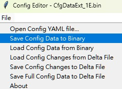
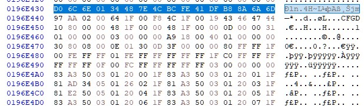

# 使用CfgDataTool改動IFWI binary設定

## Export CfgData from IFWI binary

輸出CFGDATA到\Outputs\rplp目錄下。<br>
```
python D:\SBL\slimbootloader\BootloaderCorePkg\Tools\CfgDataTool.py export -i D:\SBL\slimbootloader\Outputs\rplp\688400S0180V108.bin -o Outputs\rplp\
```


## Config board specific data by ConfigEditor

**1. 打開GUI介面**
```
python D:\SBL\slimbootloader\BootloaderCorePkg\Tools\ConfigEditor.py
```

**2. Load YAML**

- Outputs\rplp\CfgDataDef.yaml<br>

**3. Load Config Data from binary**

- Config data: CfgDataExt_1E.bin<br>

- Load完以後測試修改"Platform Name"欄位從"688400S"到"6884XXX"<br>

## Save Config Data

ConfigEditor.py 有三個，如下，後續將分別探討個別使用情境<br>



**情境一 : Save Config Data to Binary**

**1. Save modified Config Data**
- CfgDataExt_1E_6884XXX.bin

- 目前fail狀況如下<br>
```
D:\SBL\slimbootloader>python D:\SBL\slimbootloader\BootloaderCorePkg\Tools\CfgDataTool.py merge -o D:\SBL\slimbootloader\Outputs\rplp\CfgData_NEW.bin D:\SBL\slimbootloader\Outputs\rplp\CfgDataInt.bin D:\SBL\slimbootloader\Outputs\rplp\CfgDataExt_1E.bin
Traceback (most recent call last):
  File "D:\SBL\slimbootloader\BootloaderCorePkg\Tools\CfgDataTool.py", line 1014, in <module>
    sys.exit(Main())
  File "D:\SBL\slimbootloader\BootloaderCorePkg\Tools\CfgDataTool.py", line 1011, in Main
    return Args.func(Args)
  File "D:\SBL\slimbootloader\BootloaderCorePkg\Tools\CfgDataTool.py", line 775, in CmdMerge
    CfgData.Parse(CfgBinFile)
  File "D:\SBL\slimbootloader\BootloaderCorePkg\Tools\CfgDataTool.py", line 361, in Parse
    DataCond = CCfgData.CDATA_COND.from_buffer(CondBin)
ValueError: Buffer size too small (0 instead of at least 4 bytes)
```

**2. Save modified Config Data**
- CfgDataExt_1E_6884XXX.dlt

<br>
Q1: 為什麼會有internal和external data?

**Slim Bootloader: Internal vs. External CFGDATA 比較表**<br>

特性|Internal CFGDATA (內部配置)|External CFGDATA (外部配置)
---|---|---|
存放位置| 編譯時直接嵌入在 SBL 的二進位檔（Binary）中。|存放在 Flash 的獨立分區（通常是 CFG 分區）。
角色定義| 預設值 (Default)：提供最基礎、保險的設定。|覆蓋值 (Override)：針對特定硬體版本做微調。
修改難度| 高：必須重新編譯並燒錄整個 SBL 映像檔。|低：可獨立更新，甚至在出貨後透過工具局部修改。
優先順序| 較低：僅作為後備（Fallback）。|較高：SBL 啟動時會優先尋找並套用。
安全機制|隨 SBL 本體一同被驗證（Root of Trust）。|通常需要獨立簽章驗證，驗證失敗則回退至內部配置。

---略---<br>

CmdExport的時候，為了從Stage1B找到CFGDATA，會依GUID來找，

Q1: python印出來offset=0x19430，為什麼看flash map 落在offset=0x196E430<br>

已知 Internal CFGDATA 是 Stage1B 的一部分，那

假設 0x196E430 = Base + 0x19430<br>
=> Base=0x1955000<br>



<br>

**AI筆記:**<br>
> bytearray 是 Python 的內建類別（Built-in Type），不需要安裝或匯入任何模組，就可以直接在程式碼中使用它。<br>
> **關鍵特性有兩個：**
> 1. **儲存位元組 (Bytes)：** 每個元素都必須是 $0 \le x < 256$ 的整數。<br>
> 2. **可變性 (Mutable)：** 這是它與 `bytes` 物件最大的不同。你可以直接修改 `bytearray` 中的某個元素，而不需要重新建立整個物件。<br>
