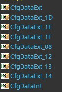
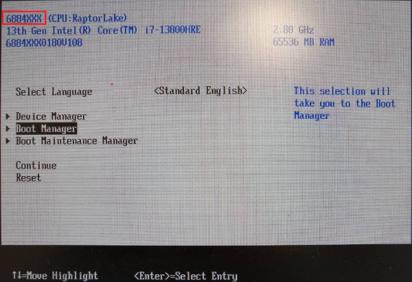

# 使用SBL tool改動board specific configure設定

**My steps**

**1. Export CfgData from IFWI binary**

After run below command, the tool will exporting external CFGDATA for each Platform ID (e.g CfgDataExt_1E.bin).

```
python D:\SBL\slimbootloader\BootloaderCorePkg\Tools\CfgDataTool.py export -i Outputs\rplp\688400S0180V108.bin -o Outputs\rplp\
```




**2. Config board specific data by ConfigEditor**

Open the GUI interface. After launching, Load YAML using the following YAML file: CfgDataDef.yaml. Then Load Config Data from binary using CfgDataExt_1E.bin.

python D:\SBL\slimbootloader\BootloaderCorePkg\Tools\ConfigEditor.py

Outputs\rplp\CfgDataDef.yaml

After loading, modify the "Platform Name" field from **"688400S"** to **"6884XXX"**.

Save Config Data to DLT, and named the file CfgDataExt_1E.dlt .

**3. Generate modified IFWI binary**

**3.1**
```
python BootloaderCorePkg\Tools\GenCfgData.py GENBIN Outputs\rplp\CfgDataDef.yaml;Outputs\rplp\CfgDataExt_1E.dlt Outputs\rplp\TEMP.bin
```

**3.2**
```
python BootloaderCorePkg\Tools\CfgDataTool.py merge -o Outputs\rplp\CfgDataExt_MOD.bin Outputs\rplp\CfgDataInt.bin Outputs\rplp\TEMP.bin
```

**3.3**
```
python D:\SBL\slimbootloader\BootloaderCorePkg\Tools\CfgDataTool.py sign -o Outputs\rplp\CfgDataExt_MOD_SIGN.bin -k KEY_ID_CFGDATA_RSA3072 -a SHA2_384 -s RSA_PSS -svn 0 Outputs\rplp\CfgDataExt_MOD.bin
```

**3.4**
```
python BootloaderCorePkg\Tools\CfgDataTool.py replace -i Outputs\rplp\688400S0180V108.bin Outputs\rplp\CfgDataExt_MOD_SIGN.bin -o Outputs\rplp\NEW.bin
```

## 測試結果


<br>
Q1: 為什麼會有internal和external data?

**Slim Bootloader: Internal vs. External CFGDATA 比較表**<br>

特性|Internal CFGDATA (內部配置)|External CFGDATA (外部配置)
---|---|---|
存放位置| 編譯時直接嵌入在 SBL 的二進位檔（Binary）中。|存放在 Flash 的獨立分區（通常是 CFG 分區）。
角色定義| 預設值 (Default)：提供最基礎、保險的設定。|覆蓋值 (Override)：針對特定硬體版本做微調。
修改難度| 高：必須重新編譯並燒錄整個 SBL 映像檔。|低：可獨立更新，甚至在出貨後透過工具局部修改。
優先順序| 較低：僅作為後備（Fallback）。|較高：SBL 啟動時會優先尋找並套用。
安全機制|隨 SBL 本體一同被驗證（Root of Trust）。|通常需要獨立簽章驗證，驗證失敗則回退至內部配置。

